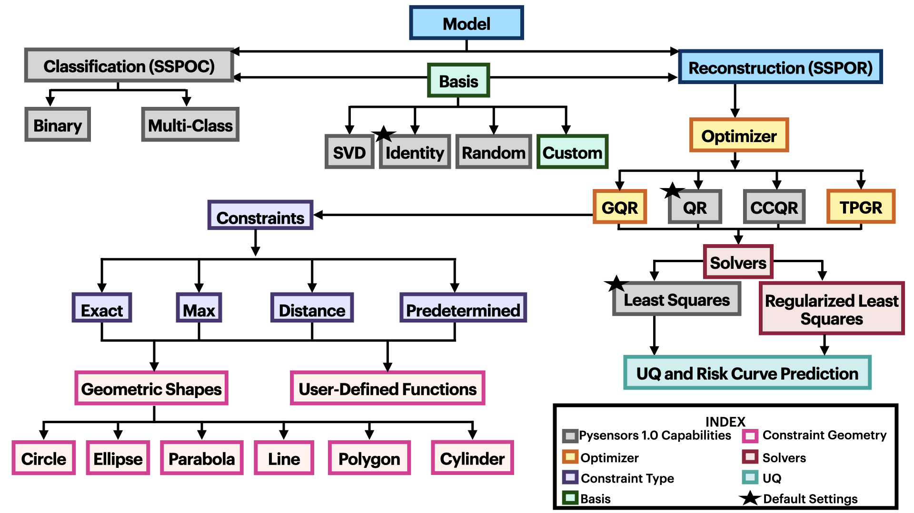
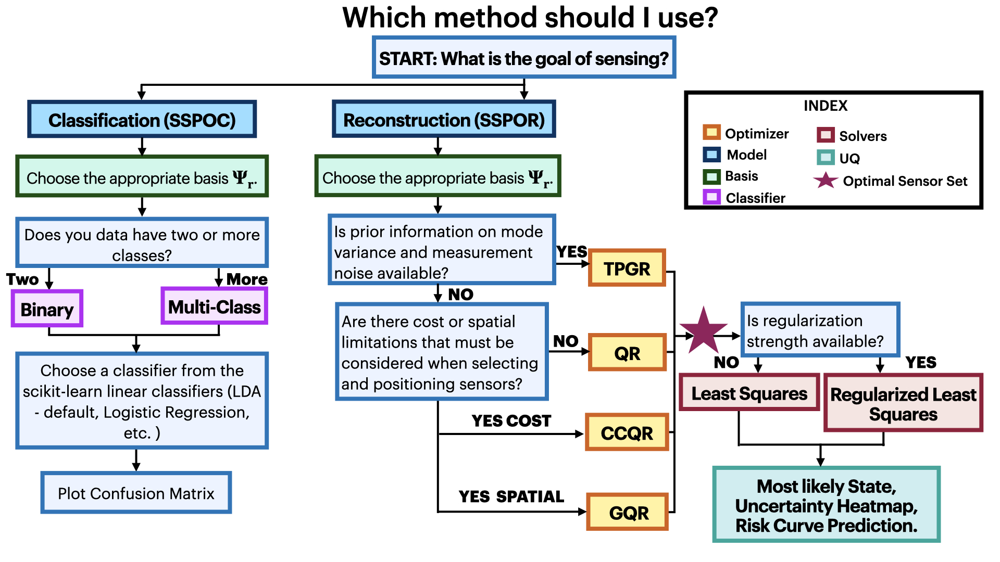

PySensors
=========
|Build| |RTD| |PyPI| |Codecov| |Binder| |JOSS| |Zenodo|

**PySensors** is a Scikit-learn style Python package for the sparse placement of sensors, either for reconstruction or classification tasks.

.. contents:: Table of contents

Sparse sensor placement
-----------------------

Sparse sensor placement concerns the problem of selecting a small subset
of sensor or measurement locations in a way that allows one to perform
some task nearly as well as if one had access to measurements at *every*
location.

PySensors provides objects designed for the tasks of *reconstruction* and
*classification*. See Manohar et al. (2018) for more information about
the PySensors approach to reconstruction problems and Brunton et al.
(2016) for classification. de Silva et al. (2021) contains a full
literature review along with examples and additional tips for
using PySensors effectively.

The diagram below shows current Pysensors capabilities.

Reconstruction
^^^^^^^^^^^^^^
Reconstruction deals with predicting the values of a quantity of interest at different locations other than those where sensors are located.
For example, one might predict the temperature at a point in the middle of a lake based on temperature readings taken at various other positions in the lake.

PySensors provides the ``SSPOR`` (Sparse Sensor Placement Optimization for Reconstruction) class to aid in the solution of reconstruction problems.

Take representative examples of the types of data to be reconstructed (in this case polynomials)

.. code-block:: python

  x = numpy.linspace(0, 1, 1001)
  data = numpy.vander(x, 11).T  # Create an array whose rows are powers of x

feed them to a ``SSPOR`` instance with 10 sensors, and

.. code-block:: python

  model = pysensors.reconstruction.SSPOR(n_sensors=10)
  model.fit(data)

Use the ``predict`` method to reconstruct a new function sampled at the chosen sensor locations. There are two methods of reconstruction using ``predict``: ``Unregularized Reconstruction`` and ``Regularized Reconstruction``.

.. code-block:: python

  f = numpy.abs(x[model.selected_sensors]**2 - 0.5)
  # Unregularized reconstruction can be used using the method ``unregularized``
  f_pred_unregularized = model.predict(f, method='unregularized')
  # Regularized reconstruction, on the other hand is the default method for predict. It also requires other parameters like prior and noise
  f_pred_regularized = model.predict(f, prior, noise)

See `reconstruction comparison example <https://python-sensors.readthedocs.io/en/latest/examples/reconstruction_comparison.html>`__ for more information on the methods of reconstruction.

.. figure:: docs/figures/vandermonde.png
  :align: center
  :alt: A plot showing the function to be reconstructed, the learned sensor locations, and the reconstruction.
  :figclass: align-center

Reconstruction with constraints
^^^^^^^^^^^^^^^^^^^^^^^^^^^^^^^
In most engineering applications, certain areas within the region of interest might allow a limited number of sensors or none at all.
We develop a data-driven technique that incorporates constraints into an optimization framework for sensor placement, with the primary objective
of minimizing reconstruction errors under noisy sensor measurements.

This work has been implemented in the general QR optimizer for sensor selection.
This is an extension that requires a more intrusive access to the QR optimizer to facilitate a more adaptive optimization. It is a generalized version of cost constraints
in the sense that users can allow `n_const_sensors` in the constrained area. If n = 0 this converges to the CCQR results. If there is
no constrained region it should converge to the results from QR optimizer.

To implement constrained sensing we initialize the optimizer GQR and provide it additional kwargs such as the constrained region, number of allowable
sensors in the constrained region and the type of constraint.

Three strategies to deal with constraints are currently developed:

* ``max_n`` - Number of sensors in the constrained region should be less than or equal to the allowable constrained sensors.

* ``exact_n`` - Number of sensors in the constrained region should be exactly equal to the allowable constrained sensors.

* ``predetermined`` - A number of sensor locations are predetermined and the aim is to optimize the rest.

* ``distance constrained`` - Enforces a minimum distance 'r' between selected sensors.

.. code-block:: python

  optimizer_exact = ps.optimizers.GQR()
  opt_exact_kws={'idx_constrained':sensors_constrained,
          'n_sensors':n_sensors,
          'n_const_sensors':n_const_sensors,
          'all_sensors':all_sensors,
          'constraint_option':"exact_n"}

We have further provided functions to compute the sensors in the constrained regions. For example if the user provides the center and radius of a circular
constrained region, the constraints in utils compute the constrained sensor indices. Direct constraint plotting capabilities have also been developed.

The constrained shapes currently implemented are: ``Circle``, ``Cylinder``, ``Line``, ``Parabola``, ``Ellipse``, ``Polygon``.
A user can also define their own constraints using ``UserDefinedConstraints``, this type of constraint has the ability to take in either a function or a .py file which contains a functional definition of the constrained region.

See `this example <https://python-sensors.readthedocs.io/en/latest/examples/Olivetti_constrained_sensing.html>`__ for more information.

Classification
^^^^^^^^^^^^^^
Classification is the problem of predicting which category an example belongs to, given a set of training data (e.g. determining whether digital photos are of dogs or cats).
The ``SSPOC`` (Sparse Sensor Placement Optimization for Classification) class is used to solve classification problems.
Users familiar with Scikit-learn will find it intuitive:

.. code-block:: python

  model = pysensors.classification.SSPOC()
  model.fit(x, y)  # Learn sensor locations and fit a linear classifier
  y_pred = model.predict(x_test[:, model.selected_sensors])  #  Get predictions

See our set of `classification examples <https://python-sensors.readthedocs.io/en/latest/examples/classification.html>`__ for more information.

Bases
^^^^^
The basis in which measurement data are represented can have a dramatic
effect on performance. PySensors implements the three bases most commonly
used for sparse sensor placement: raw measurements, SVD/POD/PCA modes, and random projections. A user can also define their own custom basis. Bases can be easily incorporated into ``SSPOR`` and ``SSPOC`` classes:

.. code-block:: python

  basis = pysensors.basis.SVD(n_basis_modes=20)
  recon_model = pysensors.reconstruction.SSPOR(basis=basis)
  class_model = pysensors.classification.SSPOC(basis=basis)

See `this example <https://python-sensors.readthedocs.io/en/latest/examples/basis_comparison.html>`__ for further discussion of these options.

Installation
-------------

Dependencies
^^^^^^^^^^^^
The high-level dependencies for PySensors are Linux or macOS and Python 3.9-3.12. ``pip`` is also recommended as is makes managing PySensors' other dependencies much easier. You can install it by following the instructions `here <https://packaging.python.org/tutorials/installing-packages/#ensure-you-can-run-pip-from-the-command-line>`__.

PySensors has not been tested on Windows.

Installing with pip
^^^^^^^^^^^^^^^^^^^

If you are using Linux or macOS you can install PySensors with pip from the command line/terminal:

.. code-block:: bash

  pip install python-sensors

**Note:** the name you type in here **is** ``python-sensors`` and is **not** ``pysensors``.

Once you have run the line above, you are ready to get started with PySensors. Have a look at the examples in our `documentation <https://github.com/dynamicslab/pysensors#documentation>`__ to see what PySensors can do.

Installing from source
^^^^^^^^^^^^^^^^^^^^^^
First clone this repository:

.. code-block:: bash

  git clone https://github.com/dynamicslab/pysensors.git

Then, to install the package, run

.. code-block:: bash

  cd pysensors
  pip install .

If you do not have pip you can instead use

.. code-block:: bash

  python setup.py install

If you do not have root access, you should add the ``--user`` option to the ``install`` commands above.

Features
--------
The primary PySensors objects are the ``SSPOR`` and ``SSPOC`` classes, which are used to choose sensor locations optimized for reconstruction and classification tasks, respectively. Other implemented objects include

* ``basis`` - submodule implementing different bases in which to represent data

  - ``Identity`` - use raw measurement data
  - ``SVD`` - efficiently compute first k left singular vectors
  - ``RandomProjection`` - gaussian random projections of measurements
  - ``CustomBasis`` - user defined bases ranging from DMD modes to Chebyshev polynomials

* ``optimizers`` - submodule implementing different optimizers to fit data

  - ``QR`` - greedy QR optimizer
  - ``CCQR`` - greedy cost constrained QR optimizer
  - ``GQR`` - general QR optimizer
  - ``TPGR`` - two point greedy optmizer
* Convenience functions to aid in the analysis of error as number of sensors or basis modes are varied

The diagram below outlines a flow chart of how a user can utilize pysensors.

Documentation
-------------
PySensors has a `documentation site <https://python-sensors.readthedocs.io/en/latest/index.html>`__ hosted by readthedocs.
Examples are available `online <https://python-sensors.readthedocs.io/en/latest/examples/index.html>`__, as static
`Jupyter notebooks <https://github.com/dynamicslab/pysensors/tree/master/examples>`__ and as `interactive notebooks <https://gesis.mybinder.org/binder/v2/gh/dynamicslab/pysensors/654e8144e44bcdc4e481b59a36c496033ef90bf6>`__. To run the example notebooks locally you should install the dependencies in ``requirements-examples.txt``:

.. code-block:: bash

  pip install -r requirements-examples.txt

Community guidelines
--------------------

Getting support
^^^^^^^^^^^^^^^
You may create an issue for any questions that aren't answered by the `documentation <https://python-sensors.readthedocs.io/en/latest/index.html>`__ or `examples <https://python-sensors.readthedocs.io/en/latest/examples/index.html>`__.

Contributing examples
^^^^^^^^^^^^^^^^^^^^^
If you have used PySensors to solve an interesting problem, please consider submitting an example Jupyter notebook showcasing
your work!

Contributing code
^^^^^^^^^^^^^^^^^
We welcome contributions to PySensors. To contribute a new feature please submit a pull request. To get started we recommend installing the packages in ``requirements-dev.txt`` via

.. code-block:: bash

    pip install -r requirements-dev.txt

This will allow you to run unit tests and automatically format your code. To be accepted your code should conform to PEP8 and pass all unit tests. Code can be tested by invoking

.. code-block:: bash

    pytest

We recommend using ``pre-commit`` to format your code. Once you have staged changes to commit

.. code-block:: bash

    git add path/to/changed/file.py

you can run the following to automatically reformat your staged code

.. code-block:: bash

    pre-commit

Note that you will then need to re-stage any changes ``pre-commit`` made to your code.

Reporting issues or bugs
^^^^^^^^^^^^^^^^^^^^^^^^
If you find a bug in the code or want to request a new feature, please open an issue.

Citing PySensors
----------------
We have published a short paper in the Journal of Open Source Software (JOSS). You can find the paper `here  <https://joss.theoj.org/papers/10.21105/joss.02828>`__.

If you use PySensors in your work, please consider citing it using:

.. code-block:: text

    de Silva et al., (2021). PySensors: A Python package for sparse sensor placement. Journal of Open Source Software, 6(58), 2828, https://doi.org/10.21105/joss.02828``

Bibtex:

.. code-block:: text

  @article{de Silva2021,
    doi = {10.21105/joss.02828},
    url = {https://doi.org/10.21105/joss.02828},
    year = {2021},
    publisher = {The Open Journal},
    volume = {6},
    number = {58},
    pages = {2828},
    author = {Brian M. de Silva and Krithika Manohar and Emily Clark and Bingni W. Brunton and J. Nathan Kutz and Steven L. Brunton},
    title = {PySensors: A Python package for sparse sensor placement},
    journal = {Journal of Open Source Software}
  }

References
------------
-  de Silva, Brian M., Krithika Manohar, Emily Clark, Bingni W. Brunton,
   Steven L. Brunton, J. Nathan Kutz.
   "PySensors: A Python package for sparse sensor placement."
   arXiv preprint arXiv:2102.13476 (2021). `[arXiv] <https://arxiv.org/abs/2102.13476>`__

-  Manohar, Krithika, Bingni W. Brunton, J. Nathan Kutz, and Steven L. Brunton.
   "Data-driven sparse sensor placement for reconstruction: Demonstrating the
   benefits of exploiting known patterns."
   IEEE Control Systems Magazine 38, no. 3 (2018): 63-86.
   `[DOI] <https://doi.org/10.1109/MCS.2018.2810460>`__

-  Brunton, Bingni W., Steven L. Brunton, Joshua L. Proctor, and J Nathan Kutz.
   "Sparse sensor placement optimization for classification."
   SIAM Journal on Applied Mathematics 76.5 (2016): 2099-2122.
   `[DOI] <https://doi.org/10.1137/15M1036713>`__

-  Clark, Emily, Travis Askham, Steven L. Brunton, and J. Nathan Kutz.
   "Greedy sensor placement with cost constraints." IEEE Sensors Journal 19, no. 7
   (2018): 2642-2656.
   `[DOI] <https://doi.org/10.1109/JSEN.2018.2887044>`__

-  Karnik, Niharika, Mohammad G. Abdo, Carlos E. Estrada-Perez, Jun Soo Yoo, Joshua J. Cogliati, Richard S. Skifton, Pattrick Calderoni, Steven L. Brunton, and Krithika Manohar.
   "Constrained Optimization of Sensor Placement for Nuclear Digital Twins" IEEE Sensors Journal 24, no. 9
   (2024): 15501 - 15516.
   `[DOI] <https://doi.org/10.1109/JSEN.2024.3368875>`__

- Klishin, Andrei A., J. Nathan Kutz, Krithika Manohar
  "Data-Induced Interations of Sparse Sensors" (2023)
  `[DOI] <https://doi.org/10.48550/arXiv.2307.11838>`__

.. |Build| image:: https://github.com/dynamicslab/pysensors/actions/workflows/main.yml/badge.svg?branch=master
    :target: https://github.com/dynamicslab/pysensors/actions?query=workflow%3ACI

.. |RTD| image:: https://readthedocs.org/projects/python-sensors/badge/?version=latest
    :target: https://python-sensors.readthedocs.io/en/latest/?badge=latest
    :alt: Documentation Status

.. |PyPI| image:: https://badge.fury.io/py/python-sensors.svg
    :target: https://badge.fury.io/py/python-sensors

.. |Codecov| image:: https://codecov.io/gh/dynamicslab/pysensors/branch/master/graph/badge.svg?token=3JE6G5GDR7
    :target: https://codecov.io/gh/dynamicslab/pysensors

.. |Binder| image:: https://mybinder.org/badge_logo.svg
    :target: https://mybinder.org/v2/gh/dynamicslab/pysensors/master

.. |JOSS| image:: https://joss.theoj.org/papers/10.21105/joss.02828/status.svg
    :target: https://doi.org/10.21105/joss.02828

.. |Zenodo| image:: https://zenodo.org/badge/260577702.svg
    :target: https://zenodo.org/badge/latestdoi/260577702

