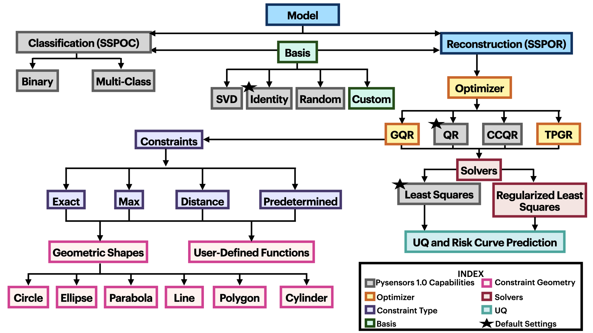
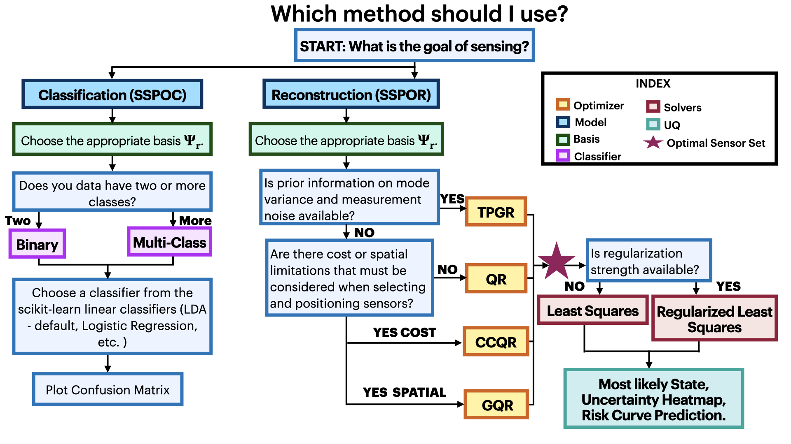

# Summary

`PySensors` is a Python package for the optimization of sparse sensor placement for reconstruction and classification tasks. This major update to `PySensors` introduces novel spatial constraints for sensor placement, including the enforcement of maximum or exact sensor counts in specific regions, predetermined sensor locations, and minimum distances between sensors. This functionality is extended to support custom basis inputs, enabling integration of any data-driven or spectral basis.  We also propose a thermodynamic approach that goes beyond a single "optimal" sensor configuration and maps the complete landscape of sensor interactions induced by the training data. This comprehensive view facilitates integration with external selection criteria and enables assessment of sensor replacement impacts. The new optimization technique also accounts for over- and under-sampling of sensors, utilizing a regularized least squares approach for robust reconstruction. Additionally, we implement noise-induced uncertainty quantification of the estimation error and provide pointwise uncertainty heat maps to guide deployment decisions. To highlight these additions, we outline the mathematical algorithms and theory underlying these new capabilities. The usage of these new features is illustrated with code examples and practical advice for implementation across multiple application domains. Finally, we outline a roadmap of potential extensions to further strengthen the package's functionality and applicability to emerging sensing challenges.

# Statement of need
The scalable optimization of sensor placement is critical for efficient monitoring, control, and decision-making in complex engineering systems. Sensor measurements are necessary for real-time estimation of high-dimensional fluid flows [@erichson2020shallow], large-scale flexible structures [@manohar2018predicting], temperature fields and pressure fields across geophysical [@alonso2010novel] and nuclear energy systems [@karnik2024constrained]. Accurate real-time tracking of key system variables depends sensitively on the locations of sensors deployed within the system, which have to be optimized for the desired task. In general, the selection of an optimal subset of sensors among candidate locations is NP-hard, necessitating heuristic or greedy approaches such as compressed sensing [@donoho2006compressed] or greedy algorithms that exploit submodularity [@krause2008near].

`PySensors` is a Python package [@de2021pysensors] dedicated to solving the complex challenge of optimal sensor placement in data-driven systems. It implements advanced sparse optimization algorithms that use dimensionality reduction techniques to identify the most informative measurement locations with remarkable efficiency [@manohar2018data;@brunton2016sparse;@clark2020multi]. It helps users identify the best locations for sensors when working with complex high dimensional data, focusing on both reconstruction [@manohar2018data] and classification [@brunton2016sparse] tasks. The package follows `scikit-learn` conventions for user-friendly access while offering advanced customization options for experienced users.  Other sensor placement packages such as `Chama` [@klise2017sensor], `Polire` [@narayanan2020toolkit], and `OSPS` toolbox [@yi2011optimal], focus primarily on event detection, Gaussian process modeling, and structural health monitoring respectively, while `PySensors` specifically targets signal reconstruction and classification applications.

The original `PySensors` code provided an implementation of `Sparse Sensor Placement for Reconstruction (SSPOR)` using the `QR` optimizer for optimal sensor selection in unconstrained placement settings in which the number of sensors $p$ is equivalent to the number of modes $r$. The previous version offered only limited support for constraints and for specifying the number of sensors, which restricts its applicability to many real-world problems. The `Cost-Constrained QR (CCQR)` framework incorporated heterogeneous cost functions into the optimization process to accommodate practical deployment constraints.
The `Sparse Sensor Placement Optimization for Classification (SSPOC)` framework identified minimal sensor configurations that can classify high dimensional signals $\mathbf{x}\in\mathbb{R}^n$ as belonging to one of $c$ classes. Data is projected into a reduced spectral or data-driven basis $r\ll n$ to enable efficient optimization. Different basis functions such as `Identity`, `SVD` and `RandomProjection` implemented in `PySensors` can significantly impact sensor selection effectiveness and reconstruction quality [@manohar2018data].

This new version of `Pysensors` focuses specifically on practical engineering applications where measurement data is inherently noisy and spatial deployment constraints are unavoidable. Key improvements include constraint-aware optimization methods that handle spatial restrictions and sensor density limitations. This version of `PySensors` implements methodologies introduced in [@klishin2023data] and [@karnik2024constrained] to make them accessible to scientists and engineers in all domains. These enhancements transform `PySensors` from a purely academic tool into a practical platform for solving real-world sensing challenges while maintaining mathematical rigor. Our code is thoroughly documented and contains extensive examples. `PySensors` is completely open-source and adheres to PEP8 stylistic standards.

# New Features

`PySensors` 1.0 implemented two sensor placement methods for reconstruction: (1) `QR`, a greedy optimization technique that places sensors throughout an unconstrained domain, and (2) `CCQR`, a cost-constrained optimization technique that accepts a user-defined vector of sensor costs throughout the domain, penalizing larger-cost locations for sensor placement.

Traditional QR factorization presents challenges for under-sampling ($p < r)$ and over-sampling ($p > r$) regimes in which the number of sensors $p$ is strictly greater or less than the model rank $r$, respectively, and cannot enforce complex spatial constraints. `PySensors 2.0` addresses these limitations through two new optimization algorithms: `Generalized QR (GQR)` and `Two Point GReedy (TPGR)`.

Implementing spatially constrained sensor placement requires a deeper intervention in the underlying QR optimization framework. To address this requirement, we add the generalized QR `GQR` optimization functionality based on recent work [@karnik2024constrained], which provides the architectural flexibility needed to handle complex spatial constraints. We enhance the algorithm's capabilities by implementing diverse spatial constraints options: `maxn`, `exactn`, `predetermined`, and `distance`. Pre-defined constraint regions include  ‘Circle‘, ‘Ellipse‘, ‘Polygon‘, ‘Parabola‘, ‘Line‘, and ‘Cylinder‘. Additionally, users can define a custom constraint using a `.py` python file or an equation string.

In the context of reduced order models with truncation rank r, over-sampling refers to deploying more sensors than the dimensionality of the reduced subspace (i.e., $p > r$ sensors), while under-sampling involves using fewer sensors than the model rank ($p < r$). The objective that the `QR` optimizer is based on suffers from two limitations, it is not defined for the under-sampling regime, and the underlying optimization is difficult to interpret and visualize directly. Ref. [@klishin2023data] resolves these with a new optimization technique that accounts for over- and under-sampling scenarios in sensor placement and decomposing the resulting objective into sums over the placed sensors
$$
\mathcal{H}\equiv -\log \det(\mathbf{S}^{-2}+(\mathbb{S} \boldsymbol{\Psi}_r)^T(\mathbb{S} \boldsymbol{\Psi}_r)/\eta^2)\approx E_b+\sum\limits_{i\in \gamma}h_i+\sum\limits_{i\neq j \in\gamma}J_{ij} \
$$
The Two Point Greedy (TPGR) optimizer uses the above approximate objective, which allows the user to specify any number of sensors
$p$ for a given mode number
$r$. In contrast, the QR pivoting algorithm always returns exactly
$p=r$ sensors, ordered by decreasing importance, with any additional sensors selected randomly. Beyond this flexibility, TPGR can also generate sensor placement energy landscapes, providing insight into the relative quality of different sensor configurations.

`PySensors 2.0` adds the Regularized Least Squares solution derived in Ref. [@klishin2023data]:
$$
    \mathbf{A}_{RLS}=\left( \mathbf{S}^{-2}+(\mathbb{S} \boldsymbol{\Psi}_r)^T(\mathbb{S} \boldsymbol{\Psi}_r)/\eta^2 \right)^{-1} (\mathbb{S} \boldsymbol{\Psi}_r)^T/\eta^2,
$$
This Regularized Least Squares solution is the new default reconstruction solver for `PySensors 2.0`, replacing the Least Squares solution via the Moore-Penrose pseudoinverse.
We implement uncertainty quantification metrics from [@klishin2023data] to assess the propagation of measurement noise through reconstruction algorithms and provide robust pointwise error estimates in reconstruction outputs. In addition, this version adds support for custom bases, so that researchers can transform their data into an alternative basis such as dynamic mode decomposition (DMD) modes before passing it to `PySensors`.

Finally, we demonstrate these new functionalities using new notebook examples for nuclear energy component systems, and update and streamline existing notebooks for sea surface temperature and image reconstruction.

# Acknowledgments
The authors would like to thank B. de Silva for valuable feedback. The authors acknowledge support from the Boeing Company; the National Science Foundation through the Mathematical Foundations of Digital Twins (MATH-DT) program under Award Nos. 2529361 and 2529362; NSF AI Institute in Dynamic Systems under grant 2112085 and the Idaho National Laboratory (INL) Laboratory Directed Research \& Development (LDRD) Program under DOE Idaho Operations Office Contract DE-AC07-05ID14517 for LDRD-22A1059-091FP.

# References